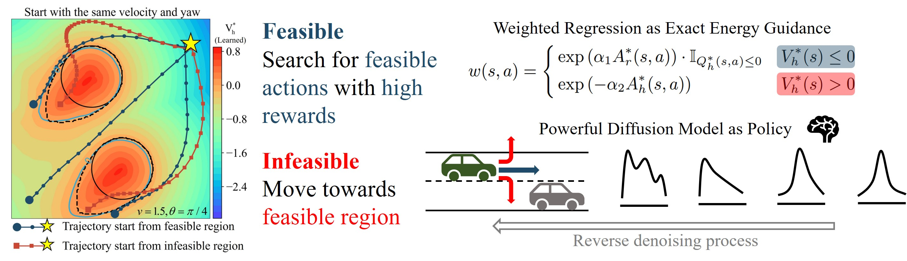

# Safe Offline Reinforcement Learning with Feasibility-Guided Diffusion Model 

The official implementation of FISOR, which **represents a pioneering effort in considering hard constraints (Hamilton-Jacobi Reachability) within the safe offline RL setting**. 

- Project Page: [https://zhengyinan-air.github.io/FISOR/](https://zhengyinan-air.github.io/FISOR/)
- Paper: [https://openreview.net/forum?id=j5JvZCaDM0](https://openreview.net/forum?id=j5JvZCaDM0)

# Methods
FISOR transforms the original tightly-coupled safety-constrained offline RL problem into
three decoupled simple supervised objectives: 

- Offline identification of the largest feasible region;
- Optimal advantage learning;
- Optimal policy extraction via time-independent classifier-guided diffusion model, enhancing both performance and stability.
<p float="left">

</p>

## Branches Overview
| Branch name 	| Usage 	|
|:---:	|:---:	|
| [master](https://github.com/ZhengYinan-AIR/FISOR) 	| FISOR implementation for ``Point Robot``, ``Safety-Gymnasium`` and ``Bullet-Safety-Gym``; data quantity experiment; feasible region visualization. |
| [metadrive_imitation](https://github.com/ZhengYinan-AIR/FISOR/tree/metadrive_imitation) 	| FISOR implementation for ``MetaDrive``; data quantity experiment; imitation learning experiment. 	|

## Installation
``` Bash
conda create -n env_name python=3.9
conda activate FISOR
git clone https://github.com/ZhengYinan-AIR/FISOR.git
cd FISOR
pip install -r requirements.txt
```

## Main results
Run
``` Bash
# OfflineCarButton1Gymnasium-v0
export XLA_PYTHON_CLIENT_PREALLOCATE=False
python launcher/examples/train_offline.py --env_id 0 --config configs/train_config.py:fisor
```
where ``env_id`` serves as an index for the [list of environments](https://github.com/ZhengYinan-AIR/FISOR/blob/master/env/env_list.py).

## Data Quantity Experiments
We can run [filter_data.py](https://github.com/ZhengYinan-AIR/FISOR/blob/master/filter_data.py) to generate offline data of varying volumes. We also can download the necessary offline datasets ([Download link](https://cloud.tsinghua.edu.cn/d/591cf8fd6d8649a89df4/)). Then run
``` Bash
python launcher/examples/train_offline.py --env_id 17 --config configs/train_config.py:fisor --ratio 0.1
```
where ``ratio`` refers to the proportion of the processed data to the original dataset.

## Feasible Region Visualization
We need to download the necessary offline dataset for ``Point Robot`` environment ([Download link](https://cloud.tsinghua.edu.cn/d/162d6fe92bde43e28676/)). Training FISOR in the ``Point Robot`` environment
``` Bash
python launcher/examples/train_offline.py --env_id 29 --config configs/train_config.py:fisor
```
Then visualize the feasible region by running [viz_map.py](https://github.com/ZhengYinan-AIR/FISOR/blob/master/launcher/viz/viz_map.py).
<p float="left">

</p>

## Bibtex

If you find our code and paper can help, please cite our paper as:
```
@inproceedings{zheng2024feasibility,
  title={Safe Offline Reinforcement Learning with Feasibility-Guided Diffusion Model},
  author={Zheng, Yinan and Li, Jianxiong and Yu, Dongjie and Yang, Yujie and Li, Shengbo Eben and Zhan, Xianyuan and Liu, Jingjing},
  booktitle={The Twelfth International Conference on Learning Representations},
  year={2024},
  url={https://openreview.net/forum?id=j5JvZCaDM0}
}
```

## Acknowledgements

Parts of this code are adapted from [IDQL](https://github.com/philippe-eecs/IDQL) and [DRPO](https://github.com/ManUtdMoon/Distributional-Reachability-Policy-Optimization).
